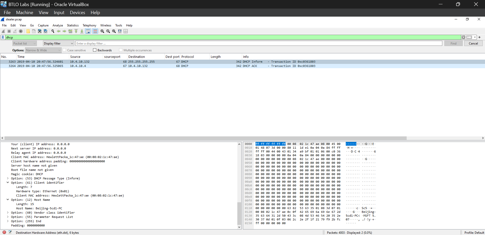
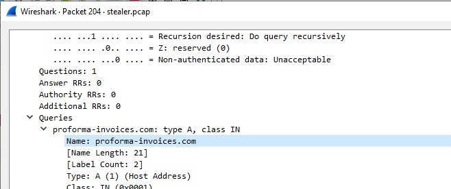
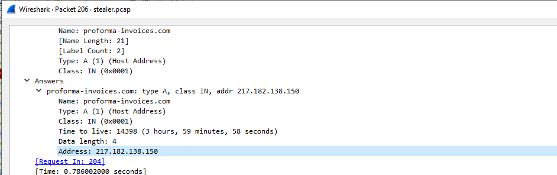

# HawkEye-Lab-CyberDefenders
This repository contains my notes and analysis from the [HawkEye lab](https://cyberdefenders.org/blueteam-ctf-challenges/hawkeye/) on [CyberDefenders](https://cyberdefenders.org/blueteam-ctf-challenges/achievements/Niharika/hawkeye/). 
The lab focuses on **network traffic analysis** and **Blue Team operations** using **Wireshark**.

## References - [HawkEye lab](https://cyberdefenders.org/blueteam-ctf-challenges/hawkeye/)

## Tools Used: `Wireshark`

## Scenario:
An accountant at your organization received an email regarding an invoice with a download link. Suspicious network traffic was observed shortly after opening the email. As a SOC analyst, investigate the network trace and analyze exfiltration attempts.

## Questions:

## Q1 : How many packets does the capture have?  
**Answer:** `4003`  

___  

## Q2 : At what time was the first packet captured?  
**Answer:** `2019-04-10 20:37`  

___  

## Q3 : What is the duration of the capture?  
**Answer:** `01:03:41`  

___  

## Q4 : What is the most active computer at the link level?  
**Answer:** `00:08:02:1c:47:ae`  

___  

## Q5 : Manufacturer of the NIC of the most active system at the link level?  
**Answer:** `Hewlett-Packard`  

___  

## Q6 : Where is the headquarters of the company that manufactured the NIC?  
**Answer:** `Palo Alto`  

___  

## Q7 : The organization works with private addressing and netmask /24. How many computers are involved in the capture?  
**Answer:** `3`  

In Wireshark under Statistics > Endpoints, I observed 4 IP addresses. One of them was 10.4.10.255, which is the broadcast address for the /24 network and not an actual host. Excluding the broadcast address, there are 3 computers involved in the capture.

___  

## Q8 : What is the name of the most active computer at the network level?  
**Answer:** `BEIJING-5CD1-PC`  

___  

## Q9 : What is the IP of the organization's DNS server?  
**Answer:** `10.4.10.4`  

___  

## Q10 : What domain is the victim asking about in packet 204?  
**Answer:** `proforma-invoices.com`  

___  

## Q11 : What is the IP of the domain in the previous question?  
**Answer:** `217.182.138.150`  

___  

## Q12 : Indicate the country to which the IP in the previous section belongs.  
**Answer:** `France`  

___  

## Q13 : What operating system does the victim's computer run?  
**Answer:** `Windows NT 6.1`  

___  

## Q14 : What is the name of the malicious file downloaded by the accountant?  
**Answer:** `tkraw_Protected99.exe`  

___  

## Q15 : What is the MD5 hash of the downloaded file?  
**Answer:** `71826ba081e303866ce2a2534491a2f7`  

___  

## Q16 : What software runs the webserver that hosts the malware?  
**Answer:** `LiteSpeed`  

___  

## Q17 : What is the public IP of the victim's computer?  
**Answer:** `173.66.146.112`  

___  

## Q18 : In which country is the email server to which the stolen information is sent?  
**Answer:** `United States`  

The email server is the host that communicated over SMTP submission (port 587) and sent ~6 KB in the capture; this IP is the malicious mail server — geolocate that IP to determine the country.

___  

## Q19 : Analyzing the first extraction of information, what software runs the email server?  
**Answer:** `Exim 4.91`  

___  

## Q20 : To which email account is the stolen information sent?  
**Answer:** `sales.del@macwinlogistics.in`  

___  

## Q21 : What is the password used by the malware to send the email?  
**Answer:** `Sales@23`  

___  

## Q22 : Which malware variant exfiltrated the data?  
**Answer:** `Reborn v9`  

___  

## Q23 : What are the Bank of America access credentials? (username:password)  
**Answer:** `roman.mcguire:P@ssw0rd$`  

___  

## Q24 : Every how many minutes does the collected data get exfiltrated?  
**Answer:** `10`  

___  

### What I Learned:
- Learned to **correlate ports and data size** to spot suspicious traffic.  
- Used **Wireshark conversations** to track abnormal data flow.  
- Understood how attackers use **legitimate protocols like SMTP (port 587)** for sending stolen information.  
- Improved my **analytical and investigation skills** in network forensics.  

This challenge enhanced my ability to think like an analyst combining **technical evidence** with **behavioral reasoning** to uncover hidden threats.
